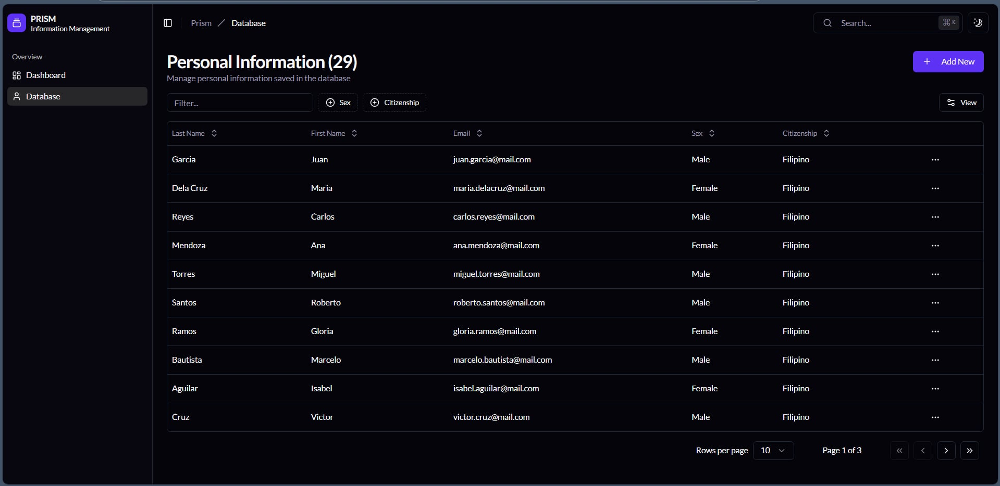
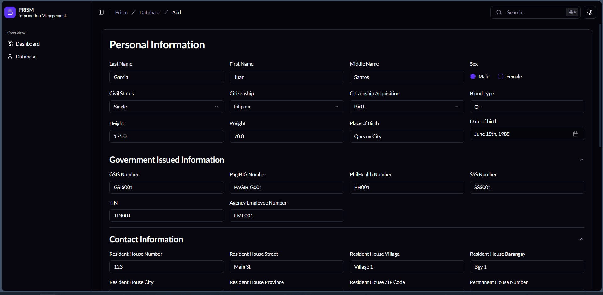

# Prism - Personal Data Management System

## 💡 About the Project

A personal data management system for organizing, storing, and retrieving information using ReactJS for the frontend and Apache Tomcat for the backend

  
  

### **⚙ Tools and Technologies Used**

1. **Next.js** – The primary React framework used for building the frontend, handling server-side rendering, routing, and static site generation.
2. **ShadCN UI** – A UI component library integrated with the frontend to create consistent, accessible, and customizable user interface elements.
3. **Node.js** – Serves as the JavaScript runtime environment for running backend services, development tools, and build processes.
4. **Java Servlet (Jakarta EE)** – Used on the backend to handle HTTP requests, implement business logic, and manage server-side operations.
5. **Apache Tomcat v11** – The application server used to deploy and run Java Servlets and JSP pages, serving dynamic content over HTTP.
6. **JSP** – JavaServer Pages used on the server side to generate dynamic HTML content and interact with Java backend logic.

## ❗❗ Disclaimer

This project was made as part of the final requirement for Information Management class at Pamantasan ng Lungsod ng Maynila. It is for learning purposes only and not meant for real-world or production use. This was a one-time submission and may not update or maintain this project regularly.

## 👥 Developers

<b>20241 BSCS 2-3

<b>LEADER: MANGUNI, John

-   CATACUTAN, Raphael James C.
-   FRIAS, Railey 
-   LIBANG, Michael Angelo
-   ROBANTE, Floyd
-   VALENZUELA, Jan
-   TAN, Hezron

